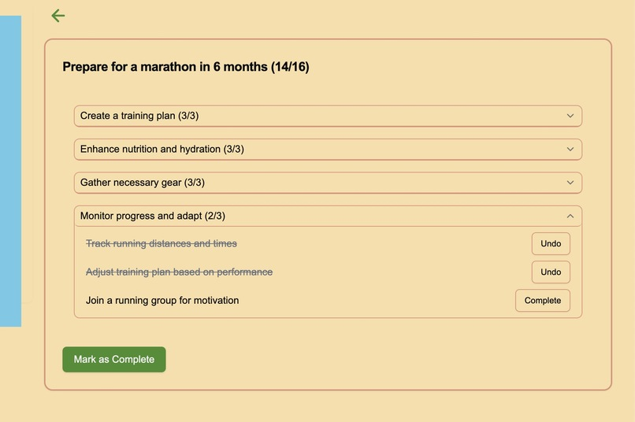
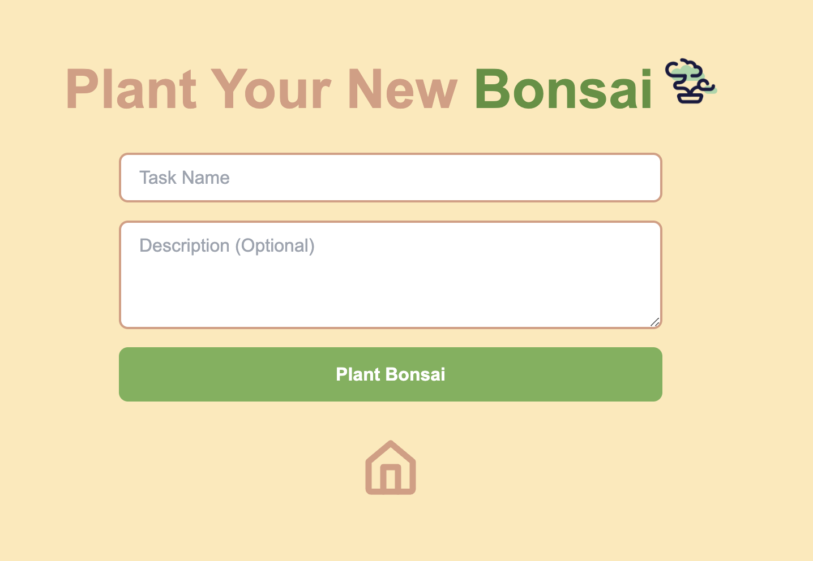
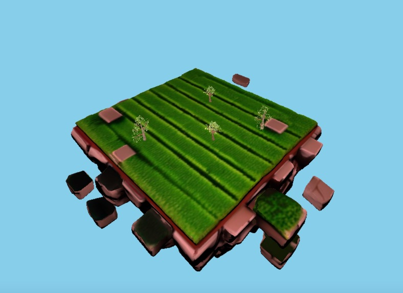

# **🌱 MagicBonsai**  
 
 ## **Overview**  
 MagicBonsai is a web application that helps users break down large projects into manageable subtasks using a visual bonsai tree. Each task represents a branch, and as users complete tasks, their tree grows dynamically. The application leverages **Express.js, MongoDB, and React (ShadCN UI)** to provide an engaging way to manage productivity.
 
 ---
 
 ## **Data Model**  
 
 ### **Entities & Relationships**  
 - **Users** own multiple **trees**.  
 - **Each tree** has **tasks** assigned to it.  
 
 ### **Sample Documents**  
 ## **[Tree Schema](server/db.js)**  
 
 ---
 
 ## **Wireframes**  
 Located in the **/documentation** folder.  
 
 ### **Single Task Page**  
 
 
 ### **Task Creation Form**  
 
 
 ### **User Task Garden**  
 
 
 ---
 
 ## **Site Map**  
 ```
 Dashboard → Task Page → Task Completion
           → Task Creation → Garden
 ```
 
 ---
 
 ## **User Stories**
 As a frantic student, I can break down my final coding project into smaller tasks, so that I can manage my workload efficiently.
 
 As a financial newb, I can create a step-by-step investment plan, so that I can good build financial habits.
 
 As someone who wants run a marathon, I can break down my training plan into milestones, so that I can stay motivated.
 
 ---
 
 # Research Topics for MagicBonsai
 
 ## 1. Frontend Framework: React + ShadCN
 ### What is it?
 React is a popular library for UI, and ShadCN is a component library that accelerates UI development customizable components.
 
 ### Why use it?
 Using React allows for a dynamic and interactive frontend experience, while ShadCN provides a pre-styled component system that speeds up development. This combination ensures a visually appealing and intuitive UI.
 
 ### Possible Solutions:
 - **React.js** for core UI
 - **ShadCN UI** for UI components
 - **Next.js** for SSR.
 
 
 ---
 
 ## 3. Unit Testing with Jest
 ### What is it?
 Jest is a testing framework for JavaScript that allows devs to write unit tests.
 
 ### Why use it?
 By implementing unit tests, we ensure that core features work as expected. This increases the stability of the application and prevents bottlenecks during development.
 
 ### Possible Solutions:
 - **Jest** for unit testing
 
 ---
 
 ## 3. User Authentication with JWT & bcrypt
 ### What is it?
 JSON Web Tokens (JWT) are a secure way to authenticate users, while **bcrypt** is used for securely hashing passwords before storing them in the database.
 
 ### Why use it?
 Authentication ensures that users can securely manage their info. JWT enables token-based authentication, which is scalable for web applications, and **bcrypt** enhances password security by hashing and salting credentials.
 
 ### Possible Solutions:
 - **jsonwebtoken (JWT)** for secure session management
 - **bcrypt.js** for password hashing
 
 ---
 
 ## 4. Interactive Tree Visualization with Three.js
 ### What is it?
 Three.js is a JavaScript library for 3D visualizations.
 
 ### Why use it?
 Since MagicBonsai is focused on gamified task management, the bonsai tree should visually change as users complete tasks. Three.js enables this for a more immersive experience.
 
 ### Possible Solutions:
 - **Three.js** for 3D tree rendering
 
 ---
 
 ## **[Link to Initial Main Project File](server/index.js)**  
 
 ---
 
 ## **Annotations / References Used**  
 1. [Express.js Documentation](https://expressjs.com/)  
 2. [Mongoose Guide](https://mongoosejs.com/docs/)  
 3. [ShadCN Documentation](https://ui.shadcn.com/)  